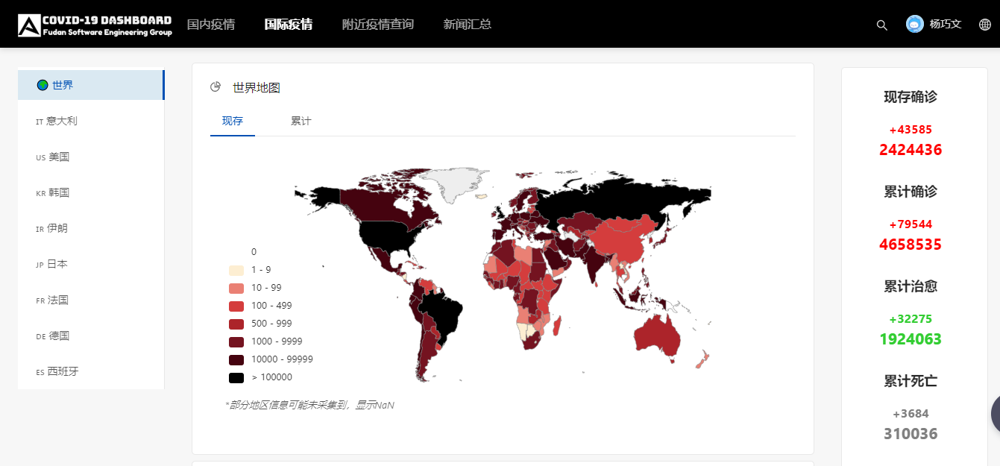
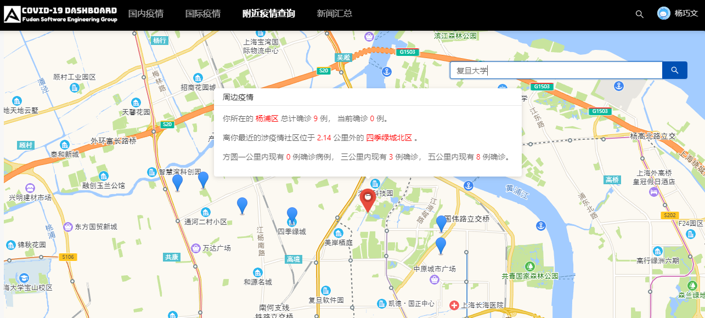

# COVID-19 Dashboard





COVID-19 Dashboard for *Software Engineering* 2020 Spring @ Fudan University, by [**FDU A6 Group**](https://github.com/FDU-SW20-6A)

## Introduction

The speed and the disruptive nature of the COVID-19 pandemic has taken public health by great surprise. With an aim to offer convenience to people, we choose to design a COVID-19 dashboard as a semester-long project for our *Software Engineering* course. Several common functions are supported into this dashboard, including gathering data and news, making visualizations, searching for nearby cases and subscribing weekly updated reports for regions.

The front-end and back-end of this site are separated to facilitate team collaboration and development. We use the [Ant Design Pro](https://pro.ant.design/) framework for the front-end development, while the back-end is written in *Python 3* using the popular Web framework [Django](https://www.djangoproject.com/). The development process for front-end and back-end can be viewed in [Frontend](https://github.com/FDU-SW20-6A/Frontend) and [covid19_be](https://github.com/FDU-SW20-6A/covid19_be) repo, respectively.

## Usage

### Installation

```bash
# Clone this repository
$ git clone git@github.com:FDU-SW20-6A/COVID-19-Dashboard.git

# Install dependencies for back-end
$ pip3 install django django-cors-headers djangorestframework validators

# Install dependencies for front-end
$ cd Frontend & npm install
```

### Usage

```bash
# Run back-end server
$ cd Backend & python manage.py runserver 8001

# Launch COVID-19 Website
$ cd Frontend & npm start

# Start the site at the local host http://127.0.0.1:8000/
```

### Test

```bash
# Run unit test for back-end
$

# Run unit and e2e test for front-end
$ cd Frontend & npm run test
```

## Features


## Code Structure

The code base is ordered as follow:


